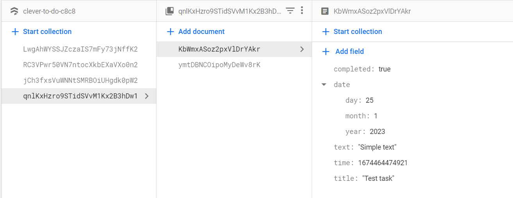

# Clever to do
To do app with calendar

#### Task
https://drive.google.com/file/d/18I1PxOxZn2lwm__YeOtMNoWeiXygKwwN/view

#### How to run the app
1. Clone the repository
2. Run <code>npm i</code>
3. Run <code>npm run dev</code> for development build, or <code>npm run build</code> for production build

#### Database snapshot


#### Application stack
1. Vite
2. Firebase
3. React Router
4. React Firebase Hooks
5. TailwindCSS
6. Prettier

#### Folder structure
```
└───src
    │   App.jsx
    │   firebase.js
    │   index.css
    │   main.jsx
    │
    └───components
        ├───Home
        │   │   Home.jsx
        │   │
        │   ├───AddTaskButton
        │   │       AddTaskButton.jsx
        │   │
        │   ├───Calendar
        │   │       Calendar.jsx
        │   │       CalendarDay.jsx
        │   │
        │   ├───Header
        │   │       Bell.jsx
        │   │       Burger.jsx
        │   │       Header.jsx
        │   │
        │   └───TaskList
        │           Task.jsx
        │           TaskList.jsx
        │
        ├───Loader
        │       Loader.jsx
        │       LoaderSVG.jsx
        │
        ├───NotFound
        │       NotFound.jsx
        │
        ├───Register
        │       Register.jsx
        │
        ├───RequireAuth
        │       RequireAuth.jsx
        │
        ├───SignIn
        │   │   SignIn.jsx
        │   │
        │   └───SignInComponents
        │           ButtonGoogle.jsx
        │           ButtonGoogleSVG.jsx
        │           Input.jsx
        │
        ├───SignOut
        │       SignOut.jsx
        │
        └───TaskEditor
            │   TaskEditor.jsx
            │
            ├───BackButton
            │       BackButton.jsx
            │
            └───EditTask
                    EditTask.jsx
                    TrashCan.jsx
```